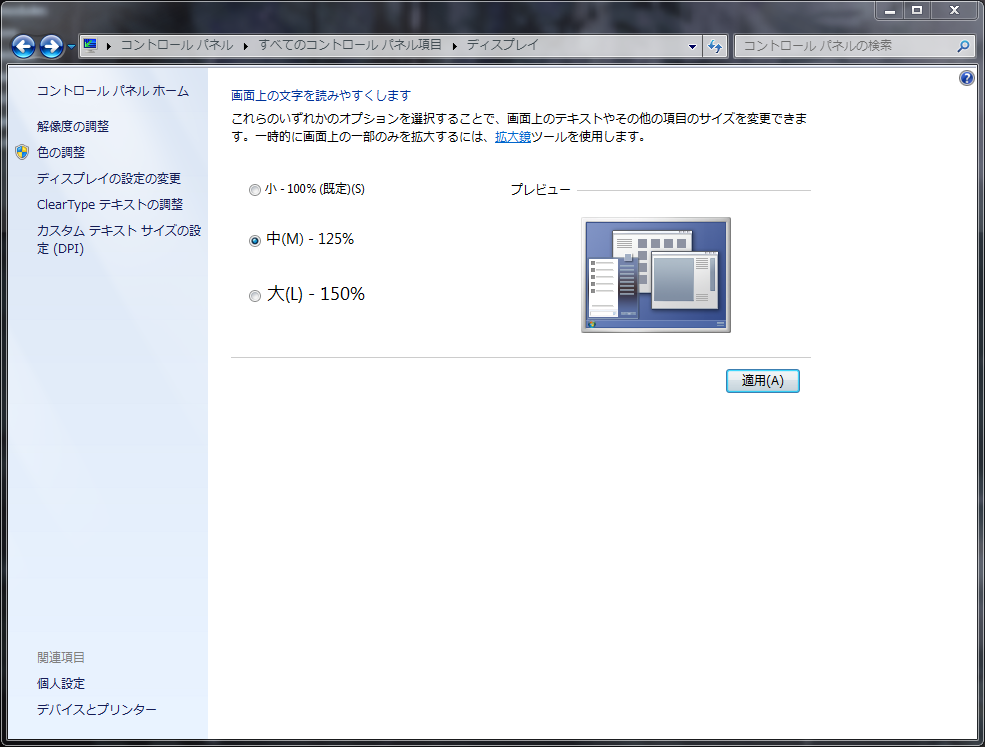

# Repro-code for a problem of phantomjs PDF generation

On Windows 7 pro, if I configured a custom font size, I have gotten a wrong result of phantomjs' PDF generation.

 (in Japanese)

Probably [this](https://www.google.co.jp/search?q=windows7+custom+font+size&tbm=isch#imgrc=trnD2vyE1U9dqM%3A) is the same window in English.

## Repro Step

1. `npm install`
2. `npm test`
3. Open `result.pdf`

It would print a bounding box of A4. The box size is specified in millimeters.

```css
.bounding-box-of-A4 {
    display: block;
    position: absolute;
    top: 0;
    left: 0;
    width: calc(210mm - 1px);
    height: calc(297mm - 1px);
    padding: 4px;
    box-sizing: border-box;
    border: 3px solid red;
}
```

Then:

- In the custom font size is 100% (default), it generated [expected.pdf](expected.pdf).
- In the custom font size is 125%, it generated [wrong.pdf](wrong.pdf). This is too small.
